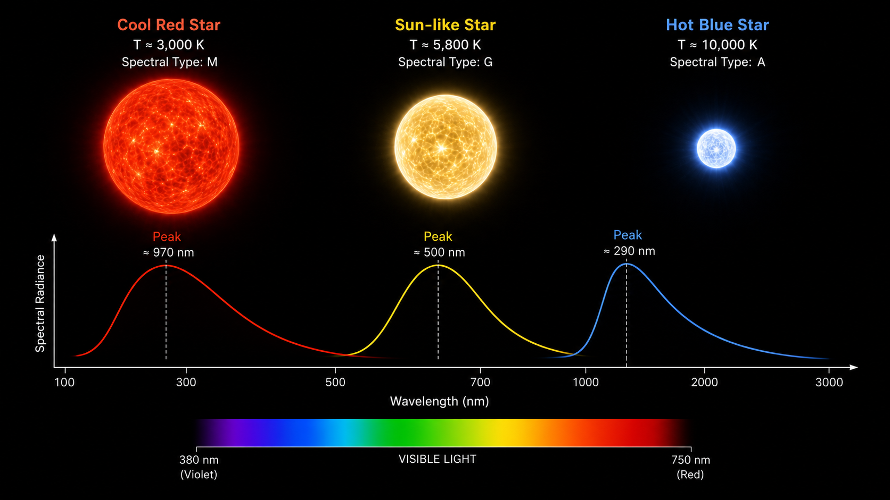
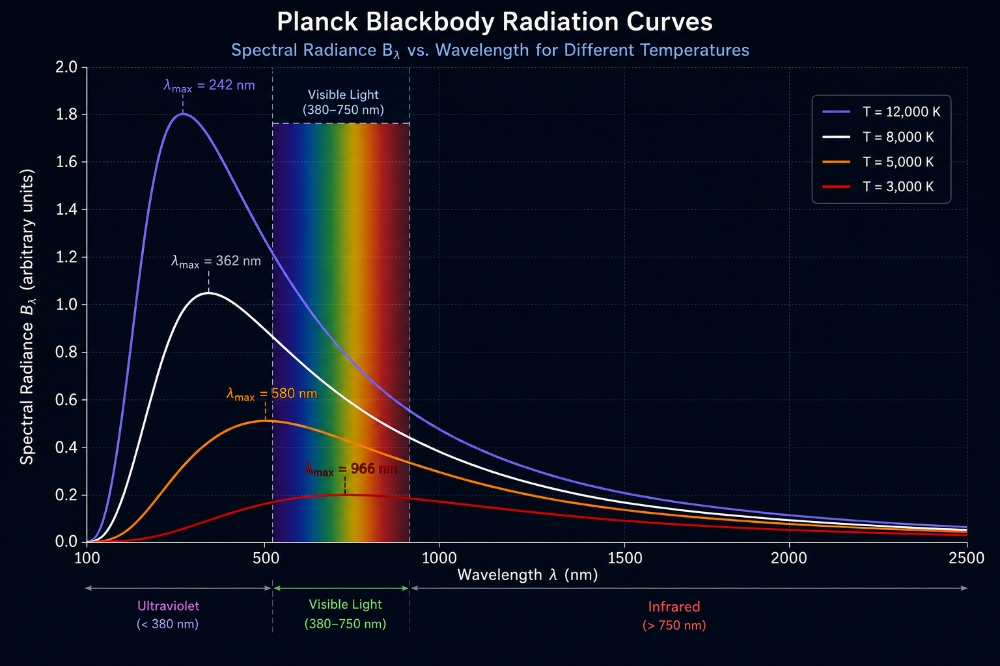
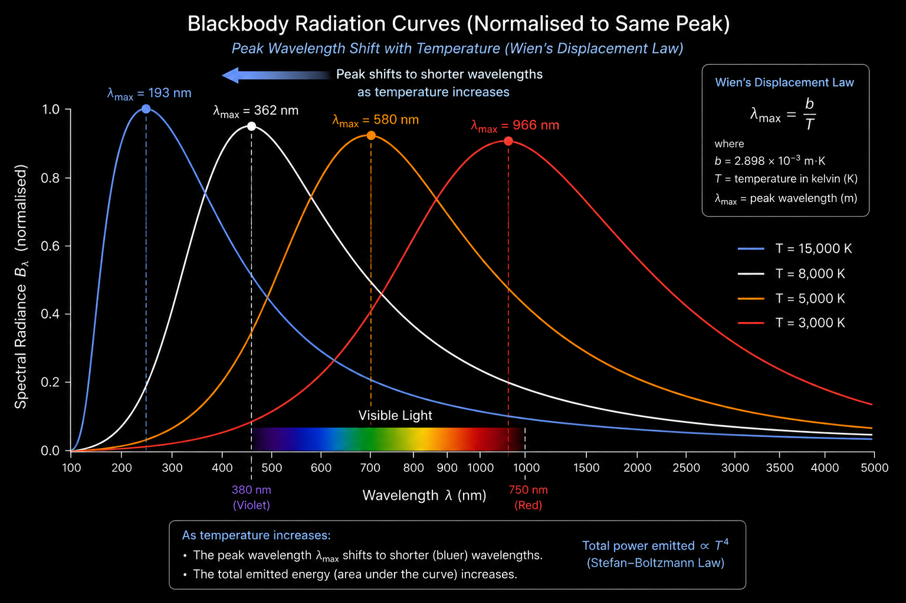
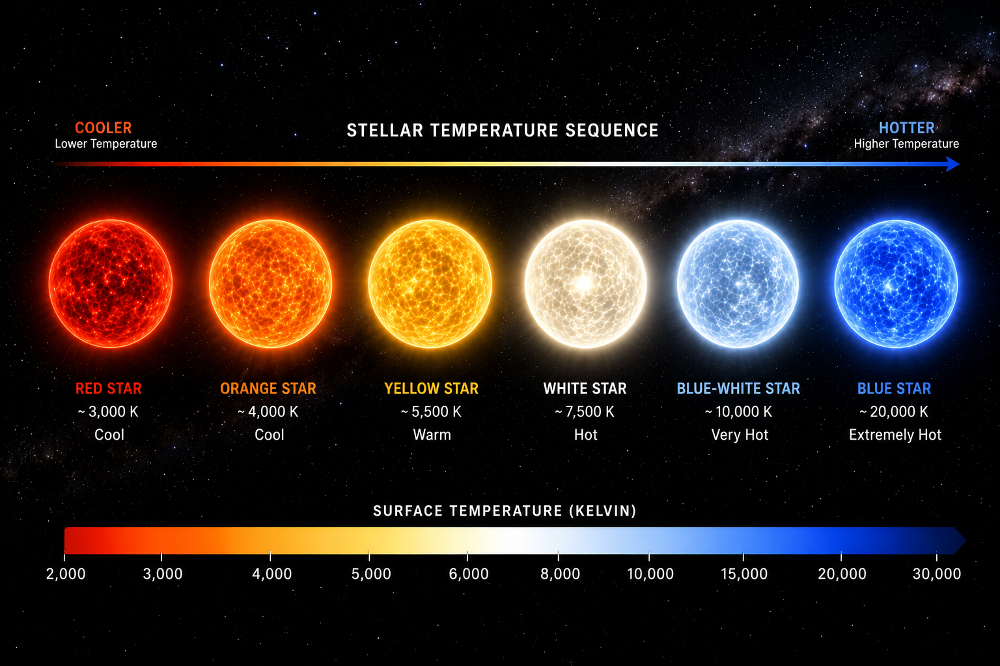
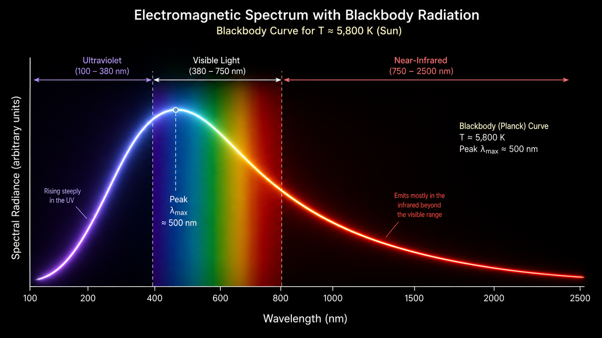

<p align="center">
  
</p>

# Blackbody Radiation Visualiser

> Interactive astrophysics tool combining Python modelling and web-based visualisation.

## What this project does

This project shows how the radiation curve of a star changes with temperature.

Users can explore:

- Planck curve shape
- peak wavelength
- Wien’s displacement law
- approximate stellar colour trend
- visible wavelength range

## Visual Understanding

### Blackbody Radiation Curves

<p align="center">
  
</p>

These curves show how the intensity and peak wavelength change with temperature.  
Hotter objects emit more energy and peak at shorter wavelengths.

---

### Wien’s Law (Peak Shift)

<p align="center">
  
</p>

As temperature increases, the peak wavelength shifts toward shorter (bluer) wavelengths.

---

### Stellar Temperature and Colour

<p align="center">
  
</p>

Stars appear red, yellow, or blue depending on their surface temperature.

---

### Electromagnetic Spectrum Context

<p align="center">
  
</p>

The visible spectrum is only a small part of the full emission range.

## Physics background

A blackbody emits radiation across a continuous range of wavelengths. The peak wavelength depends on temperature:

λmax = b / T

where:

- λ_max = peak wavelength
- T = temperature (K)
- b = 2.898 × 10⁻³ m·K

As temperature increases, the peak shifts towards shorter wavelengths.

## Why this matters

Blackbody radiation is important in:

- stellar astrophysics
- exoplanet science
- spectroscopy
- thermal physics
- radiation laws
- observational astronomy

## Live Demo

[Try the interactive tool](https://biswajit1999.github.io/blackbody-radiation-visualiser/web/)

## Licence and attribution

Code in this repository is released under the MIT Licence.

Images, diagrams, written explanations, and educational content are © 2026 Biswajit Jana unless otherwise stated.  
Please credit this repository if you reuse or adapt any visual or explanatory material.
Educational images and written explanations are licensed under CC BY 4.0.
Attribution is required.

Suggested attribution:

“Blackbody Radiation Visualiser by Biswajit Jana — https://github.com/Biswajit1999/blackbody-radiation-visualiser”

## Python version

Run:

```bash
pip install -r requirements.txt
python main.py


